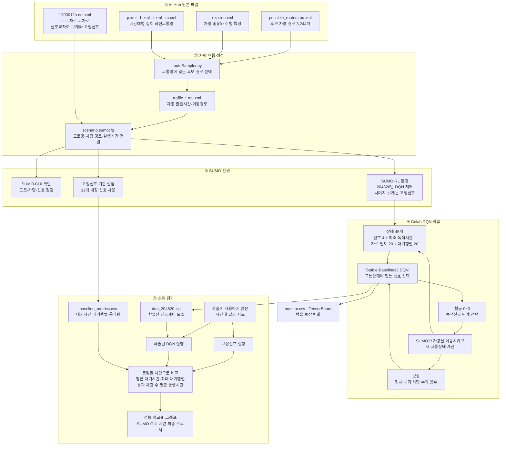

# 실제 교통량 기반 강화학습 교차로 신호 최적화

AI Hub의 부천시 교통량과 도로망을 SUMO에 적용하고, DQN으로 단일 교차로의 신호를 제어하는 프로젝트입니다.

전체 진행 과정, 실험 결과, 연구 판단과 다음 작업은 [`PROJECT_PROGRESS.md`](PROJECT_PROGRESS.md)에 계속 기록합니다.

## 목표
- 제어 대상: 신호교차로 `204820`
- 상태: 현재 신호, 차로 밀도, 대기행렬
- 행동: 4개 녹색 신호 단계 중 하나 선택
- 보상: 현재 대기 차량 수의 음수(`queue`)
- 신호 조건: 행동 간격 5초, 황색신호 3초
- 비교: 전체 평균 대기·통행시간, 교차로 차량당 대기시간, 대기행렬, 완료율

## 프로젝트 흐름

AI Hub 데이터로 SUMO 도로망과 차량 흐름을 구성합니다. Colab에서는 DQN이 SUMO와 반복해서 상호작용하며 신호 제어를 학습하고, 마지막에 동일한 교통량에서 고정신호와 성능을 비교합니다.



## 사용 데이터

- `1200012n.net.xml`: 부천시 SUMO 도로망
- `possible_routes.rou.xml`: 차량 경로 후보
- `exp.rou.xml`: 차량 종류
- `p/b/t/m.xml`: 승용차·버스·트럭·오토바이 회전교통량

CCTV, 개별차량 궤적, OD 데이터는 사용하지 않습니다.

## 진행 과정
1. 회전교통량을 SUMO 차량 경로로 변환
2. 회전교통량 누락률 검사
3. SUMO-RL과 Stable-Baselines3 DQN 연결
4. 동일한 조건에서 고정신호·무작위·DQN 비교
5. 학습에 사용하지 않은 날짜로 최종 평가

## 폴더 구조

```text
자주프/
├── Sample/                         # AI Hub 샘플 데이터
├── 회의 내용/                      # 교수님 회의 기록
├── 자기주도프로젝트 서류양식 및 자료/ # 수업 문서
└── README.md
```

## 기술

- Python
- SUMO / SUMO-RL
- Stable-Baselines3
- DQN
- Google Colab

## SUMO 실행

프로젝트 전용 환경을 만들고 SUMO를 설치합니다.

```bash
python3 -m venv .venv
.venv/bin/python -m pip install -r requirements.txt
```

AI Hub 회전교통량을 SUMO 차량 경로로 변환하고 실행 설정을 생성합니다.

```bash
.venv/bin/python src/prepare_sumo_scenario.py
```

전처리 결과에는 차종·시간·회전 방향별 원본량, 생성량, 누락량을 기록한
`data_quality_by_movement.csv`·`.json`과 전체 누락률을 기록한
`data_quality_summary.json`이 포함됩니다. 누락률이 10%를 넘는 시나리오는
본 실험에서 제외됩니다.

여러 날짜를 내려받은 뒤에는 전체 시간대를 전처리하고 날짜 단위로 분리합니다.

```bash
.venv/bin/python src/prepare_all_scenarios.py
.venv/bin/python src/create_data_splits.py
```

같은 날짜의 시간대는 모두 같은 분할에 들어가므로 테스트 데이터가 학습에 섞이지 않습니다.

내장 고정신호로 기준 실험을 실행합니다.

```bash
.venv/bin/python src/run_fixed_baseline.py
```

도로와 차량 움직임을 화면으로 확인하려면 다음과 같이 실행합니다.

```bash
open /Applications/Utilities/XQuartz.app
.venv/bin/python src/run_fixed_baseline.py --gui
```

SUMO-GUI 상단의 실행 버튼을 누르면 차량이 움직입니다. GUI 실행은 기준선 결과 파일을 변경하지 않습니다.

## DQN 학습

SUMO-RL이 `204820` 교차로만 제어할 수 있는지 먼저 확인합니다.

```bash
.venv/bin/python src/check_rl_environment.py
```

연결이 확인되면 Stable-Baselines3 DQN을 학습합니다.

```bash
.venv/bin/python src/train_dqn.py --seed 42 --timesteps 100000
```

학습된 모델은 `results/dqn_20220810_0500/seed_42/`에 저장됩니다. 모델은
10,000단계마다, replay buffer는 50,000단계마다 체크포인트로 저장됩니다.
5,000단계 시험과 평가가 정상이면 같은 셀의 학습량을 100,000단계로 바꿔
샘플 예비실험을 다시 실행합니다.

서로 다른 학습 seed 5개를 순서대로 학습할 수도 있습니다.

```bash
.venv/bin/python src/train_dqn.py --seeds 42 43 44 45 46 --timesteps 100000
```

여러 날짜의 학습 분할을 사용하려면 `--split-file data/processed/splits.json`을
추가합니다. 최종 평가는 같은 파일의 `test` 분할을 사용합니다.

```bash
.venv/bin/python src/train_dqn.py \
  --seeds 42 43 44 45 46 --timesteps 100000 \
  --output-dir results/dqn_final \
  --split-file data/processed/splits.json --split train
```

Colab이 중단되면 Drive의 같은 단계 모델과 replay buffer를 함께 지정해 이어갑니다.

```bash
python src/train_dqn.py \
  --seed 42 --timesteps 50000 \
  --resume-model /content/drive/MyDrive/FutureTraffic/checkpoints/seed_42/dqn_state_204820_seed42_50000_steps.zip \
  --resume-replay-buffer /content/drive/MyDrive/FutureTraffic/checkpoints/seed_42/dqn_state_204820_seed42_replay_buffer_50000_steps.pkl
```

## Google Colab

[](https://colab.research.google.com/github/wkdus0608/FutureTraffic/blob/main/notebooks/FutureTraffic_Colab.ipynb)

Google Drive에 `FutureTraffic/FutureTraffic_colab_data.zip`을 올린 뒤, 노트북을
위에서부터 순서대로 실행합니다. 중간 체크포인트는 Drive에 저장하고, 최종 모델과
평가 결과는 ZIP으로 묶어 Mac의 다운로드 폴더로 내려받습니다.

## 평가

동일한 차량과 실행 조건에서 고정신호·무작위 신호·DQN을 비교합니다.

```bash
.venv/bin/python src/evaluate_policies.py \
  --seeds 42 \
  --models results/dqn_20220810_0500/seed_42/dqn_204820.zip
```

여러 난수값을 반복 평가하려면 다음과 같이 실행합니다.

```bash
.venv/bin/python src/evaluate_policies.py \
  --seeds 42 43 44 45 46 \
  --models \
    results/dqn_20220810_0500/seed_42/dqn_204820.zip \
    results/dqn_20220810_0500/seed_43/dqn_204820.zip \
    results/dqn_20220810_0500/seed_44/dqn_204820.zip \
    results/dqn_20220810_0500/seed_45/dqn_204820.zip \
    results/dqn_20220810_0500/seed_46/dqn_204820.zip
```

결과는 `results/evaluation_20220810_0500/`에 저장됩니다.

생성되는 파일은 Git에서 제외됩니다.

- `data/processed/20220810_0500/`: 도로망, 차량 경로, SUMO 설정
- `results/fixed_20220810_0500/`: 차량별 결과와 기준 성능

## 현재 상태

샘플 회전교통량으로 차량 1,270대를 생성하고 SUMO 실행을 확인했습니다.
회전 관측 1,628건 중 103건(6.33%)은 후보 경로로 만들지 못했으며, 10% 기준
이하이므로 사용하되 연구 한계로 기록합니다.
대기행렬은 매초 측정하며, 고정신호와 DQN 모두 황색신호 3초를 사용합니다.
기존 황색 2초·`diff-waiting-time` 보상 모델은 예비 결과로만 보관하고 새 설정으로 다시 학습합니다.

연구 결론은 실제 도로 운행 결과가 아니라 **AI Hub 실제 교통량을 반영한 SUMO
시뮬레이션에서 DQN이 고정신호보다 혼잡을 줄였는지**로 제한합니다.
