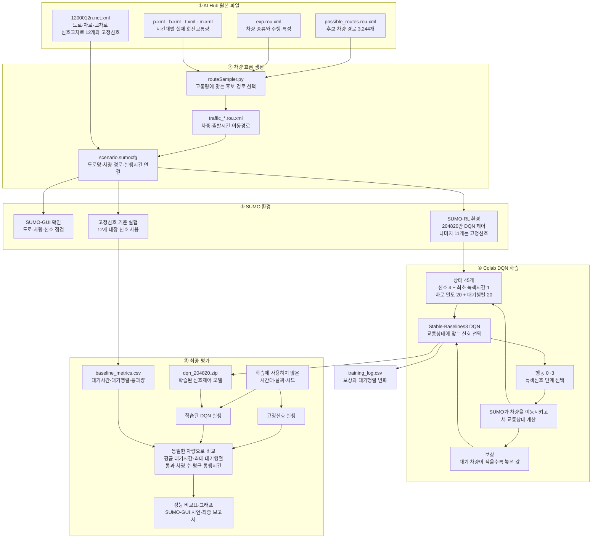

# 실제 교통량 기반 강화학습 교차로 신호 최적화

AI Hub의 부천시 교통량과 도로망을 SUMO에 적용하고, DQN으로 단일 교차로의 신호를 제어하는 프로젝트입니다.

## 목표
- 제어 대상: 신호교차로 `204820`
- 상태: 현재 신호, 차로 밀도, 대기행렬
- 행동: 4개 녹색 신호 단계 중 하나 선택
- 보상: 대기행렬 감소
- 비교: 고정신호와 DQN의 평균 대기시간, 최대 대기행렬, 통과 차량 수

## 프로젝트 흐름

AI Hub 데이터로 SUMO 도로망과 차량 흐름을 구성합니다. Colab에서는 DQN이 SUMO와 반복해서 상호작용하며 신호 제어를 학습하고, 마지막에 동일한 교통량에서 고정신호와 성능을 비교합니다.



## 사용 데이터

- `1200012n.net.xml`: 부천시 SUMO 도로망
- `possible_routes.rou.xml`: 차량 경로 후보
- `exp.rou.xml`: 차량 종류
- `p/b/t/m.xml`: 승용차·버스·트럭·오토바이 회전교통량

CCTV, 개별차량 궤적, OD 데이터는 사용하지 않습니다.

## 진행 과정
1. 회전교통량을 SUMO 차량 경로로 변환
2. 고정신호 시뮬레이션 실행
3. SUMO-RL과 Stable-Baselines3 DQN 연결
4. 동일한 교통량에서 고정신호와 DQN 비교
5. 학습에 사용하지 않은 시간대로 평가

## 폴더 구조

```text
자주프/
├── Sample/                         # AI Hub 샘플 데이터
├── 회의 내용/                      # 교수님 회의 기록
├── 자기주도프로젝트 서류양식 및 자료/ # 수업 문서
└── README.md
```

## 기술

- Python
- SUMO / SUMO-RL
- Stable-Baselines3
- DQN
- Google Colab

## SUMO 실행

프로젝트 전용 환경을 만들고 SUMO를 설치합니다.

```bash
python3 -m venv .venv
.venv/bin/python -m pip install -r requirements.txt
```

AI Hub 회전교통량을 SUMO 차량 경로로 변환하고 실행 설정을 생성합니다.

```bash
.venv/bin/python src/prepare_sumo_scenario.py
```

내장 고정신호로 기준 실험을 실행합니다.

```bash
.venv/bin/python src/run_fixed_baseline.py
```

도로와 차량 움직임을 화면으로 확인하려면 다음과 같이 실행합니다.

```bash
open /Applications/Utilities/XQuartz.app
.venv/bin/python src/run_fixed_baseline.py --gui
```

SUMO-GUI 상단의 실행 버튼을 누르면 차량이 움직입니다. GUI 실행은 기준선 결과 파일을 변경하지 않습니다.

## DQN 학습

SUMO-RL이 `204820` 교차로만 제어할 수 있는지 먼저 확인합니다.

```bash
.venv/bin/python src/check_rl_environment.py
```

연결이 확인되면 Stable-Baselines3 DQN을 학습합니다.

```bash
.venv/bin/python src/train_dqn.py --timesteps 100000
```

학습된 모델과 로그는 `results/dqn_20220810_0500/`에 저장됩니다.

생성되는 파일은 Git에서 제외됩니다.

- `data/processed/20220810_0500/`: 도로망, 차량 경로, SUMO 설정
- `results/fixed_20220810_0500/`: 차량별 결과와 기준 성능

## 현재 상태

샘플 회전교통량으로 차량 1,270대를 생성하고 고정신호 SUMO 실행을 확인했습니다. 전 차량이 정상 도착했으며, 신호 `204820`의 평균 대기시간은 약 50.01초, 최대 대기행렬은 21대였습니다. SUMO-RL에서 `204820`만 제어하는 DQN 학습 연결도 확인했습니다.
